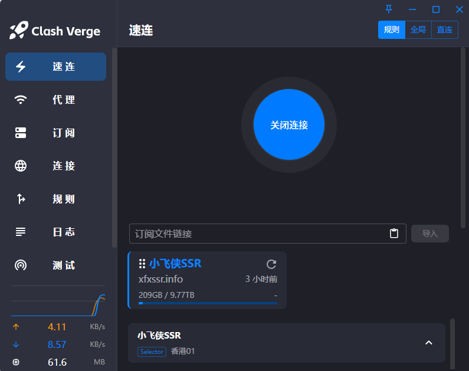
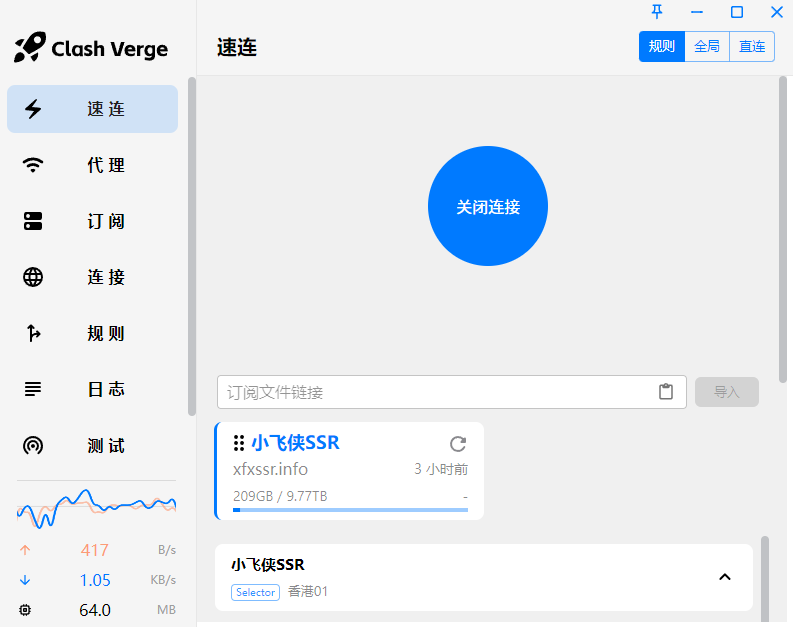

<h1 align="center">
  
  <br>
   <a href="https://github.com/zzzgydi/clash-verge">Clash Verge</a> 一键启动版
  <br>
</h1>

<h3 align="center">
A Clash Meta GUI based on <a href="https://github.com/tauri-apps/tauri">Tauri</a>.
</h3>

## Preview

| Dark                             | Light                             |
| -------------------------------- | --------------------------------- |
|  |  |

## Install

请到发布页面下载对应的安装包：[Release page](https://github.com/xfxdesk/clash-verge-oneclick/releases)<br>
Go to the [release page](https://github.com/xfxdesk/clash-verge-oneclick/releases) to download the corresponding installation package<br>
Supports Windows (x64/x86), Linux (x64/arm64) and macOS 10.15+ (intel/apple).

### 安装说明和常见问题

一键安装，安装后导入订阅地址，点击开启一键加速即可。

---

### TG Group: [@clash_verge_oneclick](https://t.me/xfxssr)

## Promotion

[小飞侠加速 —— 技术流机场 小飞侠 VPN](http://xfxssr.top)

- 使用 Clash Verge OneClick 专属邀请链接注册送 1 天 1G 流量免费试用：[快去试试](https://www.yiqidafa.top/xfx/index.html)
- 新人六折专属 6 折优惠码: xfxssr1 (仅有 500 份)
- 优惠套餐每月仅需 15 元，150G 流量，年付 7.5 折

- 海外团队，无跑路风险，高达 25% 返佣
- 集群负载均衡设计，高速专线(兼容老客户端)，极低延迟，无视晚高峰，4K 秒开
- 解锁流媒体及 ChatGPT
- 官网：http://xfxssr.top

### clash 免费订阅 高速稳定机场和免费机场推荐 每日免费

每天定时更新 [去看看](https://xfxssr.life/nav/)

最新，提供 4 个订阅地址 10 高速免费节点，支持 V2Ray、vpn、免费机场、无限流量，免费 VPN，无限流量！V2Ray 节点分享，支持 v2ray，clash，小火箭！vpn，winxray、2rayNG，BifrostV，Clash，Kitsunebi，V2rayN，V2rayW，Clash，V2rayS，Mellow，Qv2ray，v2ray，clash 机场，科学上网翻墙白嫖节点，免费梯子，白嫖梯子，免费代理，永久免费代理

本次更新节点，包括 [美国、新加坡、加拿大、香港、欧洲、日本、韩国等]共 5 个订阅地址，复制下面的节点数据，导入或者粘贴到 v2ray/iso 小火箭/winxray、2rayNG，BifrostV，Clash，Kitsunebi，V2rayN，V2rayW，Clash，V2rayS，Mellow，Qv2ray，v2ray，clash，小火箭！等科学上网工具，直接使用即可

二，自用机场推荐

包月（不限时）最低 5 元起 150GB 流量：点我了解详情

同步电报群：https://t.me/xfxssr

二，节点列表和测试速度

导入订阅地址直接使用

http://xfxssr.info/api/v1/client/subscribe?token=b063c0412cf75a5950b5c05fc7cc6300

http://xfxssr.info/api/v1/client/subscribe?token=252c1dd5d266abc205fc72755579b480

http://xfxssr.info/api/v1/client/subscribe?token=4734443fa33328252ba6c0f10e49666d

http://xfxssr.info/api/v1/client/subscribe?token=ad652844798fa966579a5b0cc35e5549

试用 clash verge 测速，秒开油管 4k 视频

## Features

- Since the clash core has been removed. The project no longer maintains the clash core, but only the Clash Meta core.
- Profiles management and enhancement (by yaml and Javascript). [Doc](https://clash-verge-rev.github.io)
- Improved UI and supports custom theme color.
- Built-in support [Clash.Meta(mihomo)](https://github.com/MetaCubeX/mihomo) core.
- System proxy setting and guard.

### FAQ

Refer to [Doc FAQ Page](https://clash-verge-rev.github.io/faq/windows.html)

## Development

See [CONTRIBUTING.md](./CONTRIBUTING.md) for more details.

To run the development server, execute the following commands after all prerequisites for **Tauri** are installed:

```shell
pnpm i
pnpm run check
pnpm dev
```

## Contributions

Issue and PR welcome!

## Acknowledgement

Clash Verge OneClick was based on or inspired by these projects and so on:

- [clash-verge-rev/clash-verge-rev](https://github.com/clash-verge-rev/clash-verge-rev): Continuation of Clash Verge - A Clash Meta GUI based on Tauri (Windows, MacOS, Linux)
- [zzzgydi/clash-verge](https://github.com/zzzgydi/clash-verge): A Clash GUI based on tauri. Supports Windows, macOS and Linux.
- [tauri-apps/tauri](https://github.com/tauri-apps/tauri): Build smaller, faster, and more secure desktop applications with a web frontend.
- [Dreamacro/clash](https://github.com/Dreamacro/clash): A rule-based tunnel in Go.
- [MetaCubeX/mihomo](https://github.com/MetaCubeX/mihomo): A rule-based tunnel in Go.
- [Fndroid/clash_for_windows_pkg](https://github.com/Fndroid/clash_for_windows_pkg): A Windows/macOS GUI based on Clash.
- [vitejs/vite](https://github.com/vitejs/vite): Next generation frontend tooling. It's fast!

## License

GPL-3.0 License. See [License here](./LICENSE) for details.
